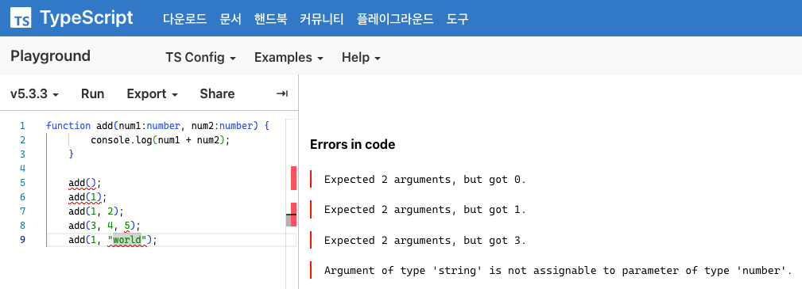

# typescript

* 유튜브 코딩앙마의 [강의 영상](https://www.youtube.com/watch?v=5oGAkQsGWkc&list=PLZKTXPmaJk8KhKQ_BILr1JKCJbR0EGlx0&index=2) 학습
* 1 - 2강

# 간단 정리

* 타입스크립트는 자바스크립트로 컴파일하고 브라우저에 전달된 후 실행된다. 그래서 컴파일 단계에서 타입을 검사하며 에러를 발견할 수 있다.

* 자바스크립트는 동적 언어다. 런타임에 타입을 결정하고 오류가 발견된다.

    ```js
    function add(num1, num2) {
        console.log(num1 + num2);
    }

    add(); // NaN
    add(1); // NaN
    add(1, 2); // 정상 작동
    add(3, 4, 5); // 작동하지만, 5는 반영안된다.
    add("hello", "world"); // 정상 작동
    ```
    

<br><br><br>

* 타입스크립트는 정적 언어다. 컴파일 타임에 타입을 결정하고 오류가 발견된다.

    ```ts
    function add(num1:number, num2:number) {
        console.log(num1 + num2);
    }

    add(); // 에러
    add(1); // 에러
    add(1, 2); // 정상 작동
    add(3, 4, 5); // 에러
    add(1, "world"); // 에러
    ```
    

## 타입

```ts
// 기본 타입
let age:number = 30;
let isAdult:boolean = true;

let a:number[] = [1, 2, 3];
let a2:Array<number> = [1, 2, 3];

let week1: string[] = ["mon", "tue"];
let week2: Array<string> = ["mon", "tue"];


// 튜플
let b:[string, number];

b = ['z', 1];
b = [1, 'z']; // 에러

b[0].toLocaleLowerCase();
b[1].toLocaleLowerCase(); // 에러


// void - return 이 없을 떄
function sayHello(): void{
    console.log("Hello");
}


// never - 에러를 던질 때
function showError() {
    throw new Error();
}


// enum 을 활용한 타입
enum Os {
    Window, // 0
    Ios, // 1
    Android // 2
}

let myOs:Os;
myOs = Os.Window;


// null, undefined
let a:null = null;
let b:undefined = undefined;
```

## 인터페이스

