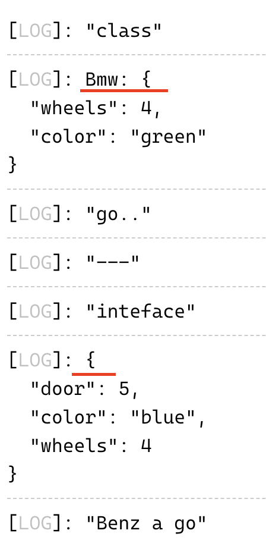

# typescript

* 유튜브 코딩앙마의 [강의 영상](https://www.youtube.com/watch?v=OIMPLNICzoc&list=PLZKTXPmaJk8KhKQ_BILr1JKCJbR0EGlx0&index=4) 학습
* 3 - 8강

# 간단 정리

## 인터페이스와 타입

### 1. 인터페이스로 객체 정의

```ts
type Score = 'A' | 'B' | 'C' | 'F'

interface User {
    name:string;
    age:number;
    gender?:string;
    readonly birthYear: number;
    // 학년 key : value 형태
    // [grade:number] : string; // 입력할 수 있는 string 이 많기 때문에 type 활용
    [grade:number] : Score;
}

let user: User = {
    name: 'xx',
    age: 30,
    birthYear:3000,
    1: 'A',
    2: 'B',
}

user.age = 10;
user.gender = "male";
user.birthYear = 2000 // 에러 발생 readonly 이기 때문이다.
```

### 2. 인터페이스로 함수 정의

```ts
interface Add {
    (num1:number, num2:number) : number;
}

const add : Add = function(x, y) {
    return x + y;
}

add(10, 20);

interface IsAdult {
    (age:number):boolean;
}

const a:IsAdult = (age) => {
    return age > 19;
}

a(33) //true
```

### 3. 인터페이스로 클래스 정의

```ts
interface Car {
    color : string;
    wheels: number;
    start(): void;
}

class Bmw implements Car {
    color;
    wheels = 4;
    constructor(c:string) {
        this.color = c;
    }
    start() {
        console.log('go..');
    }
}
```

### 4. 인터페이스로 확장하여 객체 생성

```ts
interface Benz extends Car {
    door: number;
    stop():void;
}

const benz : Benz = {
    door : 5,
    stop(){
        console.log('stop');
    },
    color : "blue",
    wheels : 4,
    start() {
        console.log('Benz a go');
    }
}
```

### 5. '3' 과 '4' 의 차이는 인터페이스는 컴파일 되면서 사라진다는 것이다.

* 3과 4를 이용해서 변수를 선언하고 `console.log` 해봤다.

    ```ts
    const bmw = new Bmw('green');
    console.log('class');
    console.log(bmw);
    bmw.start();

    console.log('---');

    console.log('inteface');
    console.log(benz);
    benz.start();
    ```
    
    * 그 결과 class 는 console 에 나오지만, 인터페이스는 안나오는 것을 볼 수 있다.

        


### 6. 인터페이스와 인터페이스로 새로운 인터페이스 확장

```ts
interface Car {
    color : string;
    wheels: number;
    start(): void;
}

interface Toy {
    name: string;
}

interface ToyCar extends Car, Toy {
    price : number;
}
```

## 함수

```ts
// ?(optional) 을 추가해줘야 한다.

function hello(name?: string) {
    return `Hello, ${name || "world"}`;
}

const result = hello();
const result2 = hello("sam");

// 초기화 하면서 매개변수를 넣을 수 있다.
function hello2(name = 'world') {
    return `Hello, ${name}`;
}

// 옵셔널 매개변수는 처음에 올 수 없다.
function hello3(name:string | undefined, age?:number) : string {
    if (age !== undefined) {
        return `Hello, ${name}. You are ${age}.`;
    } else {
        return `Hello, ${name}`;
    }
}

// 배열로 매개변수를 받는 함수
function add(...nums : number[]) {
    return nums.reduce((result, num) => result + num, 0);
}
```

## this

```ts
// this
interface User {
    name: string;
}

const Sam: User = {name:'Sam'}

// this 의 타입
function showName(this:User, age:number, gender: 'm'|'f') {
    console.log(this.name);
}

const a = showName.bind(Sam);
a(30, 'm');
```

## 오버로딩이 필요한 순간

```ts
// n 개의 타입이 매개변수 또는 반환형에 있다면 오버로딩이 필요하다.
// 타입스크립트가 정말 섬세한 언어인 것 같다.
interface User {
    name: string;
    age: number;
}

function join (name: string, age: number) : User;
function join (name: string, age: string) : string;
function join (name: string, age: number | string) : User | string {
    if (typeof age === "number") {
        return {
            name,
            age,
        };
    } else {
        return "나이는 숫자로 입력해주세요."
    }
}

const sam: User = join("Sam", 30);
const jane: string = join ("Jane", "30");
```

## 리터럴 타입

### 문자 리터럴 타입
```ts
// 문자열 리터럴 타입
const userName1 = "Bob";
let userName2 : string | number = "Tom";
userName2 = 3;

// 문자열 리터럴 타입

type Job = "police" | "developer" | "teacher";

interface User {
    name : string;
    job : Job;
}

const user: User = {
    name : "Bob",
    job : "developer",
}
```

### 숫자 리터럴 타입
```ts
// 숫자형 리터럴 타입
interface HighSchoolStudent {
    name: number | string;
    grade: 1 | 2 | 3
}
```

## 유니온 타입, `|` 를 유니온 타입이라고 한다.
```ts
interface Car {
    name : "car";
    color: string;
    start(): void;
}

interface Mobile {
    name : "mobile";
    color : string;
    call(): void;
}

function getGift(gift: Car | Mobile) {
    if (gift.name === "car") {
        gift.start();
    } else {
        gift.call();
    }
}
```

## 교차 타입
```ts
interface Car {
    name : string;
    start(): void;
}

interface Toy {
    name: string;
    color: string;
    price: number;
}

const toyCar : Toy & Car = {
    name : "타요",
    start() {},
    color: "blue",
    price: 1000,
};
```

## 클래스

* es6 의 클래스에 익숙해야 한다.

```ts
// class 의 생성자와 관련된 정보
class Car {
    // 첫번째
    color:string;
    constructor(color:string) {
        this.color = color;
    }

    // 두번째
    constructor(public color:string) {
        this.color = color;
    }
    
    // 세번째
    constructor(readonly color:string) {
        this.color = color;
    }

    start() {
        console.log("start");
    }
}

const bmw = new Car("red");
```

### 접근 제한자

```ts
// 접근 제한자 public, private, protected
/*
public - 자식 클래스, 클래스 인스턴스 모두 접근 가능
protected - 자식 클래스에서 접근 가능
private - 해당 클래스 내부에서만 접근 가능. #으로 대신할 수 있다.
static - 객체에서 접근 불가. 정적변수로 선언되기 때문에 클래스에서만 접근 가능
*/
class Car {
    name: string = "car";
    color: string;
    static wheel = 4;
    constructor(color: string) {
        this.color = color;
    }
    start() {
        console.log("start");
        console.log(this.name);
        console.log(Car.wheel);
    }
}

class Bmw extends Car {
    constructor(color: string) {
        super(color);
    }
    showName() {
        console.log(this.name);
    }
    changeName() {
        this.name = "abc";
    }
}

const z4 = new Bmw("black");
console.log(z4.showName());
```

### 추상 클래스

```ts
abstract class Car {
    color: string;
    constructor(color: string) {
        this.color = color;
    }
    start() {
        console.log("start");
    }
    // 상속받은 쪽에서 정의해야한다.
    abstract doSomething():void;
}

const car = new Car("red"); // 에러 발생. 추상클래스는 객체 생성을 못한다.

class Bmw extends Car {
    constructor(color: string) {
        super(color);
    }
    doSomething(){
        alert(3);
    }
}
```

## 제네릭

생성하는 시점에 타입을 변경하는 것.

### 함수 제네릭
```ts
function getSize<T>(arr: T[]) : number {
    return arr.length;
}

const arr1 = [1, 2, 3];
getSize<number>(arr1); //3

const arr2 = ["a", "b", "c"];
getSize<string>(arr2);

const arr3 = [false, true, true];
getSize<boolean>(arr3);

const arr4 = [{}, {}, {name: "Tim"}];
getSize<{}>(arr4);
```

### 인터페이스 제네릭
```ts
interface Mobile<T> {
    name: string;
    price: number;
    option: T;
}

const m1:Mobile<object> = {
// object 대신 {color:string, coupon:bollean} 으로 해도 된다.
    name: "s21",
    price: 1000,
    option: {
        color: "red",
        coupon: false,
    }
};

const m2: Mobile<string> = {
    name: "s20",
    price: 900,
    option: "good",
}
```

### 제네릭 타입의 확장

```ts
// 제네릭 타입의 확장
interface User {
    name: string;
    age: number;
}

interface Car {
    name: string;
    color: string;
}

interface Book {
    price: number;
}

const user: User = { name: "a", age: 10 };
const car: Car = { name: "bmw", color: "red" };
const book: Book = { price: 3000 };

function showName<T extends { name: string }>(data:T): string {
    return data.name;
}

showName(user);
showName(car);
showName(book); // 에러 발생
```

## 유틸리티 타입

### keyof

* keyof 유니온 형태로 타입 선언 
```ts
interface User {
    id: number;
    name: string;
    age: number;
    gender: "m" | "f";
}

type UserKey = keyof User; // 'id' | 'name' | 'age' | 'gender'
const uk: UserKey ="id";
```

### Partial<T>

* 타입에 옵셔널을 추가해준다.
```ts
interface User {
    id: number;
    name: string;
    age: number;
    gender: "m" | "f";
}

let admin: Partial<User> = {
    id: 1,
    name: "Bob",
}
// 이것과 같다.
// interface User {
//     id?: number;
//     name?: string;
//     age?: number;
//     gender?: "m" | "f";
// }
```

### Required<T>

* 타입을 필수로 만든다.
```ts
interface User {
    id: number;
    name: string;
    age?: number;
}

let admin: Required<User> = {
    id: 1,
    name: "Bob",
    age: 20, // 없으면 에러가 발생한다.
}
// 이것과 같다.
// interface User {
//     id: number;
//     name: string;
//     age: number;
// }
```

### Readonly<T>

* 타입을 읽기 전용으로 바꾼다.
```ts
interface User {
    id: number;
    name: string;
    age?: number;
}

let admin: Readonly<User> = {
    id: 1,
    name: "Bob"
}

admin.id = 4; // 에러 발생. Readonly 가 되니 때문에 수정이 불가능하다.
```

### Record<K, T>

* Record<K, T> Key 와 Type 이다.

```ts
// interface Score {
//     "1": "A" | "B" | "C" | "D";
//     "2": "A" | "B" | "C" | "D";
//     "3": "A" | "B" | "C" | "D";
//     "4": "A" | "B" | "C" | "D";
// };

// const score: Score = {
//     1: "A",
//     2: "C",
//     3: "B",
//     4: "D",
// };

// 아래와 같이 바꿀 수 있다.
// const score: Record<"1" | "2" | "3" | "4" , "A" | "B" | "C" | "D"> = {
//     1: "A",
//     2: "C",
//     3: "B",
//     4: "D",
// };

// 다시 아래와 같이 바꿀 수 있다.
type Grade = "1" | "2" | "3" | "4";
type Score = "A" | "B" | "C" | "D";

const score: Record<Grade, Score> = {
    1: "A",
    2: "C",
    3: "B",
    4: "D",
}

// 예제
interface User {
    id: number;
    name: string;
    age: number;
}

function isValid(user: User) {
    const result: Record<keyof User, boolean> = {
        id: user.id > 0,
        name: user.name !== "",
        age: user.age > 0,
    };
    return result;
}
```

### Pick<T, K>

* Type 에서 Key 를 가져다 쓴다.
```ts
// Pick<T, K> 타입에서 Key 를 골라서 사용

interface User {
    id: number;
    name: string;
    age: number;
    gender: "M" | "W";
}

// User 에서 id 와 name 만 가져다 사용한다.
const admin: Pick<User, "id" | "name"> = {
    id: 0,
    name: "Bob",
}
```

### Omit<T, K>

*  타입에서 Key 를 제외
```ts
interface User {
    id: number;
    name: string;
    age: number;
    gender: "M" | "W";
}

const admin: Omit<User, "age" | "gender"> = {
    id: 0,
    name: "Bob",
}
```

### Exclude<T1, T2>

* T1 타입에서 T3 타입을 제거
```ts
type T1 = string | number | boolean;
type T2 = Exclude<T1, number | string>;
```

### NonNullable<Type>

* 널 타입은 제거한다.
```ts
type T1 = string | null | undefined | void;
type T2 = NonNullable<T1> // string 과 void 가 남는다.
```